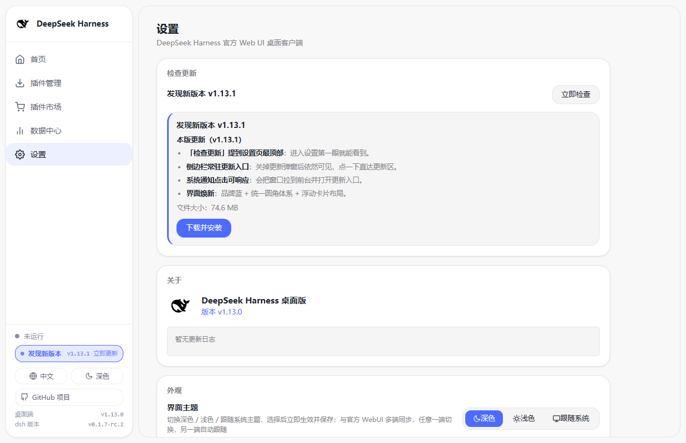
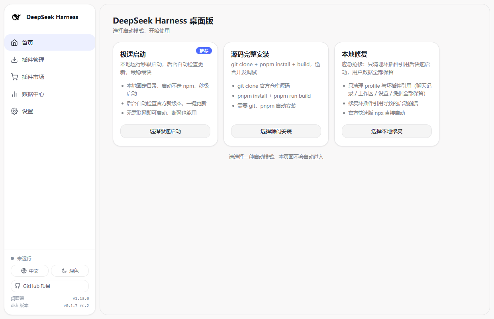
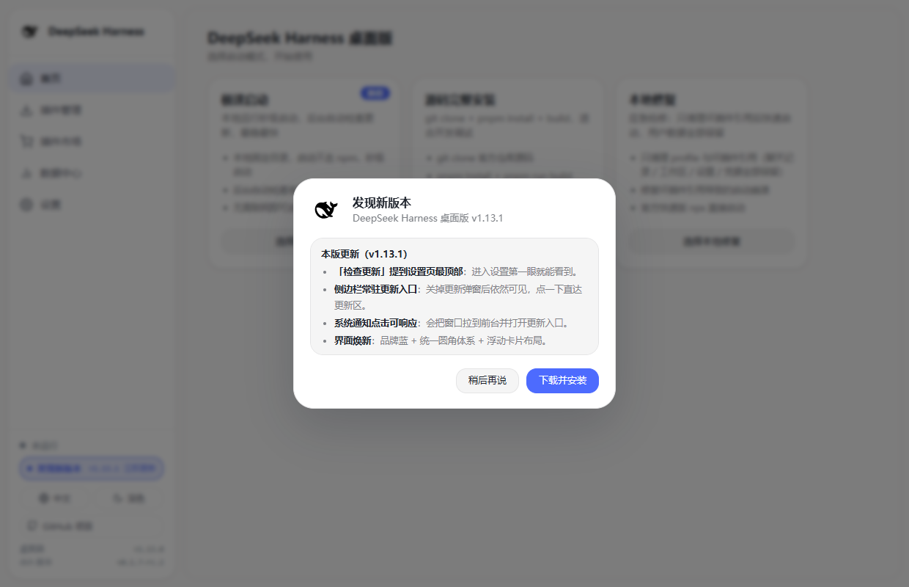
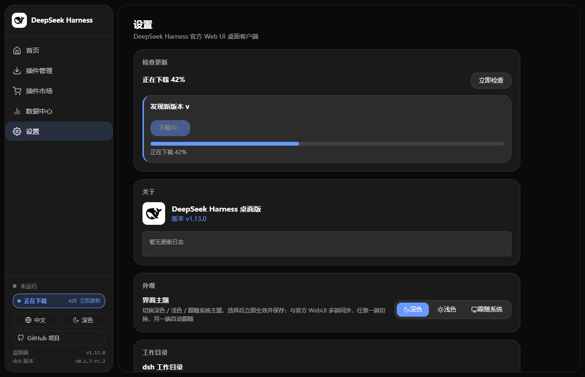

<div align="center">

# DeepSeek Harness 桌面版

[English](./README.md) | **简体中文**

**DeepSeek Harness 官方 Web UI 的 Windows 桌面客户端** —— 自动检测环境、安装依赖、拉起服务，开箱即用。


</div>

---

## 界面预览

> 截图取自 v1.13.1。控制台配色与圆角对齐 DeepSeek 官网（品牌蓝 + 统一圆角 + 浮层式布局），深色 / 浅色两套主题都已换新。

| 设置页 · 「检查更新」在页首 | 首页 · 启动管理 |
| --- | --- |
|  |  |

| 发现新版本 · 更新弹窗 | 深色主题 · 正在下载（侧栏显示进度） |
| --- | --- |
|  |  |

## 简介

一个把官方 DeepSeek Harness Web UI 封装进桌面壳的 Electron 应用。启动时选择**安装模式**，之后环境检测、安装、服务启动全部自动完成，每个阶段都有**百分比进度条**；服务就绪后自动打开主界面。

无需记命令、无需手动启动服务——双击即可用。

> **新版 dsh 认证已自动适配（v1.11.0）**：dsh `0.1.2-rc.1` 起对 Web UI 强制浏览器会话认证。桌面端会自动捕获 dsh 启动时打印的访问令牌并用它打开主界面（换取 30 天 cookie 后回到干净的裸地址），无需手动处理任何 `?token=` 链接；移动端远程访问配合插件 `@feiyang666/dsh-mobile-remote >= 1.8.0` 也支持**裸地址直达**。详见 [RELEASE_NOTES.md](./RELEASE_NOTES.md) 与本仓库 [CHANGELOG.md](./CHANGELOG.md)。
>
> **DeepSeek V4.1 Flash 已适配（v1.12.0）**：把运行环境更新到官方最新版（极速启动「一键更新」/ 设置 →「运行环境（dsh）」），官方 Web UI 即出现新模型 **`deepseek-flash`（DeepSeek-V4.1-Flash）** 与 `deepseek-v4-pro`；同时把**用量与消耗插件升级到 ≥ 1.17.0**，消耗才会按 2026-09-10 12:00（北京时间）起生效的新峰谷价计算。桌面端本身不需要改任何模型配置。

## 功能特性

### 三种安装模式

启动时选择安装方式：

| 模式 | 说明 | 适合场景 |
| --- | --- | --- |
| **极速启动** | 本地固定目录秒级启动，后台自动检查官方新版并支持一键更新（取代原「快速启动」） | 大多数用户，推荐 |
| **源码完整安装** | `git clone` + `pnpm install` + `pnpm run build` | 开发者，想改源码/调试 |
| **本地修复** | 卸载全局 `@deepseek-ai/dsh`、清理残留并重装 | 安装损坏、koffi 加载失败时修复 |

### 人性化启动引导

- **大百分比进度条** + 阶段提示，完全替代日志刷屏
- **可展开的命令行日志面板**：点一下即可查看真实输出（安装/构建过程），出错时自动展开
- 阶段文案随输出智能变化：检测环境 → 下载中 → 解压中 → 安装中 → 构建中 → 启动中

### 插件管理（独立页面 + 自定义安装）

首页提供「插件管理」入口（左侧导航），进入插件管理页：

- **推荐插件**：一键安装 / 卸载由开发者制作的插件（安装过程显示在「自定义安装」卡片的命令行日志中，完成后点「立即重启服务」即可生效）：
  - **[用量与消耗插件（dsh-usage-plugin）](https://github.com/feiyang-dev/dsh-usage-plugin)**：记录每次调用的 token 用量与缓存命中、按 DeepSeek 峰谷/基础价格计费（**≥ 1.17.0 支持 V4.1 Flash `deepseek-flash` 与 2026-09-10 12:00 起生效的新峰谷价**）、用量日历热力图、余额查询、CSV/JSON/PNG 导出
  - **[数据保险箱（dsh-vault）](https://github.com/feiyang-dev/dsh-vault)**：自动备份 `~/.dsh` 数据到 `~/.dsh-backups`、清空检测、一键恢复，保护聊天记录与工作区数据
  - **[移动端远程控制（dsh-mobile-remote）](https://github.com/feiyang-dev/dsh-mobile-remote)**：手机扫码通过局域网 / 外网远程操控电脑上的 DeepSeek Harness，远程访问密码门禁、外网隧道状态监测、设备与运行状态实时展示
- **自定义安装**：填写任意 npm 包名或安装命令（如 `@scope/plugin-name` 或 `npm install @scope/plugin-name`），客户端自动执行安装并注册到运行环境；命令行日志在「自定义安装」卡片内实时展示
- **已安装列表**：展示全部已安装插件（版本 / 注册状态），可逐个卸载
- 安装逻辑与官方 `dsh plugin add` 等价（npm 装入 profile + 注册 `dsh.profile.bundles`），**重新运行服务后生效**

> 不喜欢桌面端也可以直接在命令行安装，效果等价：
> ```bash
> dsh plugin --profile web add @feiyang666/dsh-usage-plugin
> dsh plugin --profile web add @feiyang666/dsh-vault
> dsh plugin --profile web add @feiyang666/dsh-mobile-remote
> ```

### 数据中心（一站式查看插件数据）

侧边栏新增「数据中心」独立栏目（与首页 / 插件管理 / 设置平级），服务运行期间一站式展示已安装插件的实时数据：

- **用量统计**（dsh-usage-plugin）：今日 / 本周 / 本月 / 累计四周期汇总、缓存命中率、近 30 天按天明细、按模型 / 服务商分布、最近调用记录
- **余额与凭据**（dsh-usage-plugin）：各余额服务商（DeepSeek / SiliconFlow / DigitalOcean / AMD）的凭据配置状态与余额明细
- **备份管理**（dsh-vault）：备份份数 / 时间 / 根目录 / 完整历史，一键「立即备份」
- **远程设备**（dsh-mobile-remote）：在线设备 / 累计心跳 / 局域网与外网隧道状态 / 密码门禁 / 服务运行时信息

数据来自插件自身 HTTP API，桌面端只做「桥接消费」；插件未安装 / 未运行 / 接口不可用时对应区块自动隐藏或显示「未安装」。数据变化通过插件的 **SSE 事件流实时推送**，无需手动刷新；服务停止时自动隐藏。

### 插件市场（扫描 GitHub 社区插件）

左侧导航新增「插件市场」，扫描 GitHub 上带 `dsh-plugin` 话题的公开仓库（官方推荐的社区插件发现方式）：

- **列表展示**：每个插件展示名称、作者、描述、star 数、主要语言、许可证，官方推荐插件置顶并标注「官方」
- **搜索 / 分页**：支持按关键词搜索插件名称 / 描述 / 作者，结果分页浏览
- **一键安装**：识别到仓库 `package.json` 的 npm 包名后即可一键安装（复用自定义安装的国内镜像自动切换流程）；未能识别到 npm 包的仓库标注「非 npm 包」，仅供参考
- **已安装状态**：已安装的插件在市场中直接标记「已安装」及版本号
- 扫描范围为 GitHub 公开 API，未登录时受 GitHub 限流限制（约 60 次/小时），市场页有失败提示与重试入口

### 设置与在线更新

左侧导航「设置」进入设置页面：

- **关于**：应用版本、更新日志
- **外观**：界面主题 **深色 / 浅色 / 跟随系统** 三档一键切换（持久化保存，选择后立即生效；与官方 WebUI 多端同步，任意一端切换另一端自动跟随）。dsh 0.1.7 起官方把用户设置改为存在「当前 Profile 的插件配置」里（`~/.dsh/profiles/<profile>/cordis.patch.yml` 的 `- id: ui-theme` 条目，旧 `~/.dsh/settings.yaml` 只在启动时导入一次并改名为 `settings.yaml.imported`），桌面端已按官方优先级（home patch → profile patch → settings.yaml → `.imported`）读写，两种 dsh 版本下双向同步都成立
- **通知**：新版本系统通知开关（持久化保存）；**点击系统通知会把应用窗口拉到前台并直接打开更新入口**（插件安装完成等其它通知点击后聚焦控制面板）
- **界面风格（v1.13.1 焕新）**：控制台视觉对齐 DeepSeek 官网 —— 品牌蓝强调色（浅色 `#4d6bfe` / 深色 `#6799fe`）、统一圆角体系（面板 20px · 弹窗 28px · 卡片与列表项 18px · 按钮与输入框 14px · 徽标为胶囊形）、侧栏与内容区为圆角浮层卡片；官方 WebUI 保持原样
- **开发者选项**：「开启开发者选项模式」开关（持久化保存，对下次启动生效）
- **检查更新（设置页第一个面板）**：进入设置页自动检查，支持手动检查、一键下载并安装，下载过程显示实时进度，完成后校验 SHA256。把启动时的更新弹窗点「稍后再说」关掉后，**侧边栏底部会常驻「发现新版本 · 立即更新」入口**（下载中显示进度、下载完成显示「点击安装」），点击直达设置页顶部的「检查更新」

### 开发者选项模式（前端开发专用）

开启「开发者选项模式」后，选择「源码完整安装」时会把启动**分离为两个进程**，便于迭代 DSH 浏览器端：

| 进程 | 说明 |
|---|---|
| 服务端后端 | 源码仓库方式启动 `dsh web`（`%APPDATA%/dsh-desktop/deepseek-harness`），提供 API 并托管前端，地址不变 |
| 浏览器端热更 watcher | `pnpm run dev:web`，监听全部 `dsh.client` 插件源码，改动后自动重建 bundle，浏览器免刷新热更 |

- 需先完成一次「源码完整安装」构建好源码仓库（未就绪时启动会给出引导提示）
- WebUI 窗口仍打开 `http://127.0.0.1:3080`；首页控制台显示「开发者模式」标识，停止/重新运行会同时管理两个进程
- 选择「源码完整安装」时若已开启该模式，安装完成后也会自动附带启动热更 watcher
- 关闭开关后回到单进程启动（源码模式 / 极速启动均不受影响）

### 其他特性

- **无终端窗口**：所有子进程用 `node` 直接执行，不弹命令行窗口
- **环境自动检测**：Node.js/git/pnpm 缺失时给出对应引导（Node 缺失显示下载按钮；git 缺失提示下载；pnpm 缺失自动安装）
- **服务自动拉起**：优先复用已有 3080 服务；否则启动 dsh web
- **插件兼容性检查**：与官方一致地校验插件声明的 `@deepseek-ai/dsh*` peer 版本范围（安装前经 registry 预检，本地 tarball / 目录安装后复核）；不兼容的插件在推荐插件卡片与「已安装插件」里都会标出，并可一键「允许此版本」写入**精确版本例外**（profile 的 `compatibility.json`，等价于官方 `dsh plugin allow-version`，仅对该精确版本生效）
- **启动诊断识别**：识别官方 dsh 0.1.7 的分类信号（插件/组合包因版本不兼容被跳过、必需插件条目失败、旧 `settings.yaml` 部分设置未迁移、patch 条目不存在），在日志面板补一条中文可操作指引；启动超时的报错也会带上已识别的诊断
- **修复不丢用户偏好**：dsh 0.1.7 起用户设置与 Agent 预设都存在 profile 里，「本地修复」删除 `profiles/` 前会先暂存 `ui-theme` / `preset-*` 条目与版本例外，服务下次成功启动后自动合并回去
- **系统托盘**：关闭窗口最小化到托盘，服务保持运行；托盘菜单可退出
- **干净退出**：退出时自动 `taskkill` 终止 dsh 子进程树
- **可打包分发**：`electron-builder` 生成 Windows 安装包

## 系统要求

| 依赖 | 说明 |
|---|---|
| Windows 10 / 11（x64） | 应用运行平台 |
| Node.js ≥ 18 | 极速启动模式依赖，缺失时客户端引导下载 |
| git | 仅源码模式需要（pnpm 缺失时自动安装） |
| 网络 | 首次安装需下载依赖（约数百 MB） |

> 均可在客户端内自动引导补齐，无需提前手动安装。

## 快速开始

### 开发运行

```bat
start.bat
```

或手动：

```bat
npm install
npm start
```

自定义端口：`npm start -- --port 8090`（默认 3080；若端口已有 dsh web 在运行会直接复用）。

## 目录结构

```
dsh-desktop/
├── main.js              # 主进程（模式选择/进度状态机/安装/启动/窗口/托盘/清理/更新服务/插件市场 IPC）
├── preload.js           # 安全桥接（模式/进度/日志/状态/设置/更新/插件市场 IPC）
├── plugin-manager.js    # 插件管理器（安装/卸载/查询，纯 Node 逻辑）
├── plugin-compat.js     # 插件 × dsh 运行时版本兼容性（peer 范围校验 + compatibility.json 精确版本例外，纯 Node 逻辑）
├── plugin-market.js     # 插件市场（扫描 GitHub topic:dsh-plugin，纯 Node 逻辑）
├── plugin-bridge.js     # 插件数据桥接（消费插件 HTTP API / SSE，纯 Node 逻辑）
├── boot/                # 启动引导页（首页 + 左侧导航 + 插件管理页 + 插件市场页 + 设置页 + 进度条 + 日志面板）
│   ├── boot.html
│   ├── boot.css
│   └── boot.js
├── assets/              # 打包资源（图标等）
├── pack.js              # 交互式打包脚本
├── start.bat            # 开发启动脚本
└── package.json         # 依赖与打包配置
```

## 启动流程（状态机）

```
[首页：模式选择] --用户自行选择（无自动进入）-->
   快速：检测 node → npx 下载依赖 → 启动服务
   快速+开发者选项：检测 node → 检查源码仓库 → 启动服务端后端 + 浏览器端热更 watcher（双进程）
   源码：检测 git/pnpm → clone → pnpm install --ignore-scripts → pnpm run build → 启动服务（开启开发者选项时附带启动热更 watcher）
   修复：停止服务 → 暂存用户偏好 → 清理坏插件引用（保留聊天记录 / 工作区 / 设置 / 凭据）→ 官方快速版启动
        │
        ▼
[进度] 8%检测环境 → 25-90%安装/构建/修复 → 60-95%启动服务 → 100%就绪
        │
        ▼
[首页：正在运行中] --独立新窗口打开 WebUI（http://127.0.0.1:3080）-->
   [停止运行] → 首页显示"已停止"，可重新运行或改选模式
   [重新运行] → 用上次所选模式重新走启动流程
[插件管理页] 左侧导航「插件管理」→ 推荐插件一键安装 / 自定义包名安装 / 已安装列表卸载
[插件市场页] 左侧导航「插件市场」→ 扫描 GitHub topic:dsh-plugin → 搜索 / 浏览 / 一键安装
[设置页] 首页「设置」→ 检查更新（页首：自动检查 + 下载安装）/ 关于 / 通知 / 开发者选项
```

关键实现：

### 极速启动的运行原理（为什么秒级、为什么离线可用）

**为什么原「快速启动」慢？** 快速启动走的是 `npm exec --yes -- @deepseek-ai/dsh web`（npx）。dsh 官方包拆成了 **150+ 个相互依赖的子包**（`@deepseek-ai/dsh-*`），`npm exec` 每次启动都要：

1. 向 registry **解析 `latest`**（一次 HTTP 往返）；
2. 对**每一个子包**逐个发 HTTP 请求做 `cache revalidated`（版本校验，哪怕本地已有缓存）；
3. 校验通过后**逐个解压 tarball**，组装成新的 npx 沙箱目录。

这 150+ 个包的串行校验 + 解压，即使全部命中缓存也要 **100~200 秒**（国内网络下尤其明显）——这是「启动一个服务要 200 多秒」的根因，**不是网络慢，而是 npm 每次都在重复解析整棵依赖树**。

**极速启动做了什么？** 把「安装」和「启动」彻底分离，**安装一次，启动无数次**：

- **首次（需联网一次）**：执行 `npm install @deepseek-ai/dsh --prefix <userData>/dsh-local --ignore-scripts`，把 dsh 及全部 150+ 依赖**完整解压到本地固定目录**（`%APPDATA%\dsh-desktop\dsh-local\node_modules`），形成一棵"已就绪"的依赖树并落盘。走国内镜像（npmmirror），失败自动切换。
- **之后每次启动（完全离线）**：直接 `spawn(node, [<dsh-local>/node_modules/@deepseek-ai/dsh/lib/bin.js, 'web', ...])` —— 用 Node.js 进程直接加载本地已解压的 `bin.js` 入口。**没有 npm 参与**：不解析 `latest`、不发任何 HTTP 请求、不校验 tarball、不解压依赖。Node 的 `require` 直接命中本地 `node_modules`，几秒内服务就绪。
- 工作目录与快速/修复模式保持一致（`resolveWorkspaceDir()`），保证会话历史数据归属不变。

**更新怎么解决？** 极速启动不追求"每次启动都是最新版"，而是**后台静默检查**：启动后约 8 秒（避开首次加载抢带宽），执行 `npm view @deepseek-ai/dsh version` 查询官方最新版；发现新版时首页运行状态栏显示「一键更新」，点击自动「停止服务 → 重装本地环境到最新版 → 自动重启」，全程走国内镜像、失败自动切换。断网时跳过检查，完全不影响启动。

**本地已就绪时跳过镜像测速**：`run()` 中 `ensureRegistrySelected()`（镜像并发测速）仅在极速启动且本地环境未就绪时才执行——本地已装好时直接启动，完全离线场景无需网络探测。

- 源码模式：仓库 clone 到 `%APPDATA%/dsh-desktop/deepseek-harness`（不污染工作区）；`pnpm install --ignore-scripts` 后 `pnpm run build`；启动用 `node --import tsx/esm apps/cli/src/bin.ts web`
- 启动服务均不经过 cmd.exe，无终端弹窗

## 常见问题（FAQ）

**Q: 安装过程中卡在某个百分比？**
A: 点击"命令行日志"面板查看真实输出。多数情况是网络下载慢，耐心等待即可；若长时间无进展，可用"本地修复"模式重装。

**Q: koffi 加载失败 / 版本异常怎么办？**
A: 在启动页选择"本地修复"模式，客户端会自动卸载全局包、清理残留并重装最新版。

**Q: 端口 3080 被占用？**
A: 客户端会优先复用已运行的 dsh web 服务；也可用 `npm start -- --port <port>` 指定其他端口。

**Q: 想调试 / 改源码？**
A: 选择"源码完整安装"模式，源码会 clone 到 `%APPDATA%/dsh-desktop/deepseek-harness`，构建后自动启动。

**Q: 开发者选项模式怎么用？**
A: 设置页开启「开发者选项模式」（需先完成一次"源码完整安装"），然后选择"源码完整安装"。客户端会分离运行「服务端后端」与「浏览器端热更 watcher（pnpm dev:web）」两个进程，浏览器仍打开 3080；修改 `dsh.client` 插件源码会自动重建并免刷新热更。

**Q: DeepSeek 官方发布了新版本，桌面端要怎么更新？**
A: 极速启动会**后台自动检查更新**：启动后静默查询官方最新版，发现新版时首页运行状态栏显示「一键更新」横幅，点击即可自动「停止服务 → 重装本地环境到最新版 → 自动重启」，全程走国内镜像、失败自动切换。首页运行状态会显示当前 dsh 版本；设置 →「运行环境（dsh）」可一键查看「当前版本 vs 最新版本」。断网时跳过检查，完全不影响启动。

**Q: DeepSeek 发布了 V4.1 Flash（`deepseek-flash`），桌面端需要做什么？**
A: 两步，桌面端本身不需要改任何模型配置：
1. **更新运行环境**：极速启动会后台提示「一键更新」，或到设置 →「运行环境（dsh）」一键更新到官方最新版（v0.1.5+）。更新后官方 Web UI 的模型选择器会出现 **`deepseek-flash`（DeepSeek-V4.1-Flash）** 与 `deepseek-v4-pro`；旧模型名 `deepseek-v4-flash` / `deepseek-v4-flash-vision-exp` 在 0.1.5 及更早版本下仍可调用（官方会路由到 V4.1 Flash 并按 Flash 单价计费），无需手动替换。**注意：dsh 0.1.7 起官方把 `V4 Flash` 与 `V4 Flash Vision Exp` 从默认模型列表中移除**，模型选择器里只保留新模型名；桌面端不做任何模型清单处理，升级运行环境后以 Web UI 实际显示为准。
2. **升级用量与消耗插件到 ≥ 1.17.0**：「插件管理 → 已安装插件 → 检查更新」一键升级。数据中心 / 首页的消耗金额全部由该插件计算，1.17.0 起才对 `deepseek-flash` 按官方 2026-09-10 12:00（北京时间）生效的新峰谷价计费（空闲 缓存命中 0.02 / 输入 1 / 输出 4 元，高峰为其两倍；`deepseek-v4-pro` 不变），并按每次调用的发生时刻自动选择新旧价格版本；未升级时新模型记录会被统计，但成本列显示为 0。

**Q: 升级到 dsh 0.1.7 后，桌面端和 WebUI 的主题同步会失效吗？**
A: 不会。0.1.7 起官方把用户设置从 `~/.dsh/settings.yaml` 迁到「当前 Profile 的插件配置」（`~/.dsh/profiles/<profile>/cordis.patch.yml` 的 `- id: ui-theme` 条目），旧文件只被导入一次、随后改名为 `settings.yaml.imported`。桌面端 v1.13.0 已适配：读取按官方优先级（home patch → profile patch → settings.yaml → `.imported`），写入同时落在 profile patch 与仍存在的 `settings.yaml` 上，编辑是文本级的（不动注释、其他条目与其他字段），反向监听也覆盖了这两个目录。

**Q: 「已安装插件」里显示「与当前 dsh 不兼容」是什么意思？**
A: 这是官方 dsh 0.1.7 新增的版本兼容性检查：官方在**安装与启动**时都会校验插件 `peerDependencies` 里对 `@deepseek-ai/dsh` / `@deepseek-ai/dsh-*` 的版本范围，不兼容的插件会被**拒绝加载**（组合包被跳过，或该插件行被置为禁用）。桌面端做了同样的检查，并给出两种处理方式：① 升级插件到兼容版本（推荐）；② 点击 **「允许此版本」** 授予**精确版本例外** —— 等价于官方 `dsh plugin allow-version`，写入 profile 的 `compatibility.json`，只对这个精确版本 + 当前运行时生效，插件升级或 dsh 升级后自动失效（授予前会明确提示可能崩溃或丢失数据）。

**Q: dsh 0.1.7 的 Web 侧边栏终端有什么要注意的？**
A: 官方 0.1.7 在 Web 侧边栏新增了终端，并且它以**系统用户权限**运行、**不受 Agent 沙箱模式限制**。桌面端内嵌官方 Web UI，因此这等于在应用里提供了系统级 shell：请勿把服务端口暴露到不可信网络，开启「移动端远程控制」时务必设置访问密码。

**Q: 桌面端会把模型清单写死在代码里吗？**
A: 不会。桌面端只负责「安装 / 启动 / 桥接展示」：模型清单由 dsh 运行环境自带，用量成本由插件计算，`plugin-bridge.js` 只做纯数学聚合、不含任何本地计价。因此官方新增模型时，桌面端无需改动，更新「运行环境 + 插件」即可。

**Q: 打开主界面提示 "dsh web authentication required" 怎么办？**
A: 这是新版 dsh（`0.1.2-rc.1+`）的浏览器会话认证。桌面端 v1.11.0 已自动适配：启动时自动捕获 dsh 打印的访问令牌并带它打开主界面（换取 30 天 cookie 后回到裸地址），无需手动操作。若仍出现该提示，请升级桌面端到 v1.11.0，并确认 dsh 运行环境已更新到支持该认证的官方版本。

**Q: 手机远程访问要带一长串 `?token=` 吗？**
A: 不需要。桌面端 v1.11.0 配合移动端插件 `@feiyang666/dsh-mobile-remote >= 1.8.0` 实现了**裸地址直达**：手机直接打开 `http://192.168.x.x:3080`（设置页展示的就是干净裸地址），首次访问自动完成连接授权，之后长期可直接使用。老版本插件会退回带 token 地址的展示方式。

**Q: 开发者选项模式下"本地修复"还可用吗？**
A: 可用。"本地修复"始终走官方快速版（`pnpm dlx`）单进程启动，不受开发者选项影响（修复时会同时清理残留的 watcher 进程）。

## 技术栈

- [Electron](https://www.electronjs.org/) 31 — 桌面壳
- [electron-builder](https://www.electronjs.org/app-builder) — 打包分发（NSIS）
- 原生 Web API — 启动引导页（无前端框架依赖）

## 许可证

[MIT](./LICENSE) © dsh-desktop

## 相关项目

| 项目 | 说明 | 安装方式 |
| --- | --- | --- |
| [用量与消耗插件（dsh-usage-plugin）](https://github.com/feiyang-dev/dsh-usage-plugin) | 每次调用的 token 用量/缓存命中统计、峰谷计费、余额查询、CSV/JSON/PNG 导出 | 桌面端推荐插件一键安装，或 `dsh plugin add @feiyang666/dsh-usage-plugin` |
| [数据保险箱（dsh-vault）](https://github.com/feiyang-dev/dsh-vault) | 自动备份 / 清空检测 / 一键恢复，保护聊天记录与工作区数据 | 桌面端推荐插件一键安装，或 `dsh plugin add @feiyang666/dsh-vault` |
| [移动端远程控制（dsh-mobile-remote）](https://github.com/feiyang-dev/dsh-mobile-remote) | 手机扫码局域网 / 外网远程操控，远程访问密码门禁、外网隧道状态监测、设备与运行状态实时展示 | 桌面端推荐插件一键安装，或 `dsh plugin add @feiyang666/dsh-mobile-remote` |
| [DeepSeek-Harness](https://github.com/deepseek-ai/DeepSeek-Harness) | 官方 CLI / Web 服务 | — |

---

<div align="center">

如果觉得有帮助，欢迎给本仓库点个 Star。

</div>
